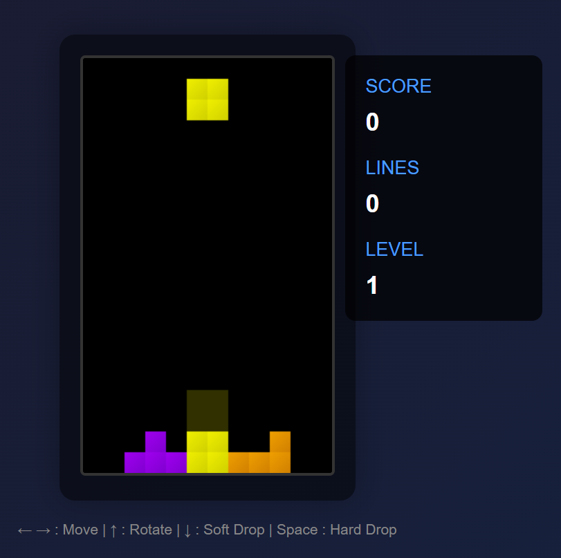

# Modern Tetris Game

A modern implementation of the classic Tetris game using HTML5 Canvas and JavaScript.

## Features

- Modern gradient-colored pieces
- Ghost piece preview
- Score tracking
- Level progression
- Line clear animations

## How to Play

1. Open `index.html` in your web browser
2. Use the following controls:
   - Left/Right Arrow: Move piece
   - Up Arrow: Rotate piece clockwise
   - Down Arrow: Soft drop
   - Space Bar: Hard drop

## Technologies Used

- HTML5 Canvas
- Vanilla JavaScript
- CSS3

## Installation

No installation required! Simply clone the repository and open `index.html` in your browser:

## Live Demo

You can play the game directly at: [Tetris Game](https://genishk.github.io/tetris-game)

## License

This project is open source and available under the [MIT License](LICENSE).
